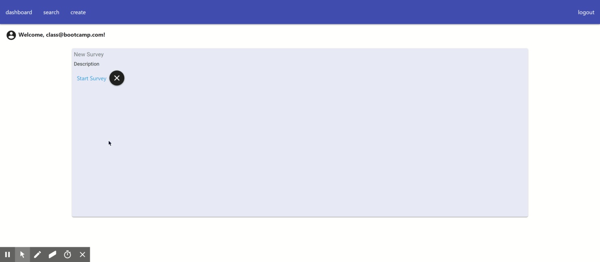

# GrowthTracker

**GrowthTracker** is a metacognitive survey platform that iteratively builds norming tables and delivers percentile ranks for your most pressing questions. Growthtracker is a MERN stack app that allows users to create an account, deploy a Likert-scale survey, respond to a survey and receive their survey results in percentile rank.

The login authentication is handled by a React form component and sent via a POST request to the server, where it establishes an authenticated session with [Passport](http://www.passportjs.org/) and hashed with [bcrypt.js](https://www.npmjs.com/package/bcryptjs).

[Hosted on Heroku](https://growthtracker.herokuapp.com/)

Demo account:

* class@bootcamp.com
* Password1!

## Tech Used
`HTML`
`CSS`
`JavaScript`
`jQuery`
`ReactJS`
`Mongoose`
`MongoDB`
`Express`
`Node.js`
`Axios`
`bcryptjs`
`Passport`
`ZenHub`

## Overview
### Login

### Create

### Attempt
